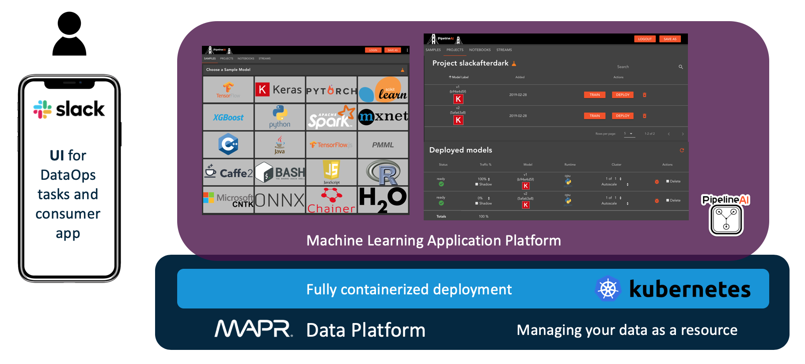

# Find your nerd match with an AI-driven dating app powered by Keras/TensorFlow, Kubernetes, and MapR

Welcome to Slack After Dark! A fun, Slack-based, AI-driven dating app demo I created to showcase an end-to-end, containerized, and integrated ML workflow. Some of the highlights include online model predictions and online model training, using a mix of cutting-edge technologies with Slack as the user interface (see Picture 1).

With this example, you’ll see how a modern data platform and the right streaming architecture can help you move from batch to real-time model training and simplify your overall machine learning data logistics.

I will demonstrate the functionality and then walk through how I created:

* An ML app to analyze and give a confidence rating on pictures, determining whether or not the photo is an engineer.
* New prediction models, by training it on new data.
* A mobile app using Slack that will take a submitted photo and, by communicating to the ML backend, return a “best match” person for the submitted photo.

Through this tongue-in-cheek example, I will demonstrate how the MapR Data Platform can:

* Support your end-to-end ML/AI workflows from training and deployment into production.
* Integrate into existing ML/AI applications, microservices frameworks, and containerization.
* Handle data logistics across files, tables, and streams to support online predictions and online model training.

Picture 1. Overall architecture and technologies – using Slack as the user interface (UI) for all DataOps tasks and the consumer-facing app, PipelineAI, as the machine learning application platform, all deployed fully containerized and managed via Kubernetes, and running on top of MapR as the data platform to manage all my data as a resource throughout the whole stack.

For this demo, I’ve developed two Slack applications (for more information on how to use the Slack API and develop your own applications, see https://api.slack.com):

"AI Monkey" - a backend service, helping me with the daily “DataOps” tasks, like running predictions or training and deploying my models.

"Slack After Dark" - my consumer-facing front-end service, an AI-powered dating app.

Picture 2. The Slack applications being used in this demo.

Let’s see the two in action!

At this point, I’m going to give you the option of watching a video of me walking through the demo and architecture, or you can read the rest of this blog to walk through the steps. And if you are really ambitious, do both!

1. Slack After Dark - Our First Match!
Slack After Dark’s primary matching algorithm uses Keras, MobileNet, and transfer learning to pair engineers with non-engineers. Opposites attract, right?!

Picture 3. Our Slack After Dark application using an AI-powered scoring and matching algorithm developed with Keras, MobileNet, and transfer learning.

Upon login, Slack After Dark uses an ensemble technique to average the image classification prediction results of two live models, v1 and v2 (more details on this in a bit), which is then passed on as an input for the matching algorithm.

Picture 4. Login to Slack After Dark and image classification prediction results.

Exciting! Let’s find my match!

Picture 5. Getting matched.

I got matched with Erlich Bachman (non-engineer) from HBO’s Silicon Valley show. I can see we share a similar fashion style already ;-) – fair enough!

Ok – so let’s have a closer look at what’s happening in the background here!

2. Online Model Predictions with Slack
Here’s an architecture view of how I’ve implemented online model predictions using Slack.

Picture 6. Architecture view of online model predictions.

I pass an image URL, using the /predict command in my Slack channel (see the Slack API documentation here for more information on how to implement slash commands). The request gets routed to the live models based on the defined traffic routing rules; let’s assume we start with just model 1 in production, which would receive 100% of the traffic.

You can also mirror the traffic to a decoy, which I implemented by sending the live traffic to a MapR stream topic called /predict_data_decoy, so we can replay the live traffic for any future use I might have.

Let’s test the model prediction with a new image – Sheldon Cooper from The Big Bang Theory TV show:

Picture 7. Requesting a single prediction with the /predict command and passing an image of Sheldon Cooper from the Big Bang Theory TV show for classification.

In this case, the AI Monkey Slack application picks up the task, processes the request by sending it to the deployed live model, and returns the prediction results.

The model returns an unconfident prediction (e.g., confidence lower than 80%) with a higher confidence in Sheldon Cooper being a non-engineer. As I’m considering the term “engineer” here in a broad scope that includes scientists as well, I want to improve the model to classify Sheldon Cooper as an engineer.

3. Online Model Training with Slack
Here’s an architecture view of how I’ve implemented Online Training using Slack.

Picture 8. Architecture view of Online Model Training

I can do this by running the /fix command with the image URL as a parameter, together with the right prediction class – in this case, engineer.

Picture 9. Providing feedback to improve the model with the /fix command.

Side note: This concept could be easily used to implement a crowd-sourced human-in-the-loop feedback mechanism to improve unconfident prediction results. Just imagine it’s not only you, but hundreds or thousands of people in that Slack channel, providing feedback on unconfident predictions and hence been posted to the channel.

So, when I pass the /fix command with the image URL and the right prediction class, a couple of steps get triggered in the background:

The data gets sent and published into a MapR stream topic called /slackafterdarkv1.
A microservice, which is subscribed to that topic as a consumer, picks up the new training data. It creates a new model run with the newly added training data under the current experiment and versions it. In this step, PipelineAI’s machine learning application platform uses an implementation of MLflow to assist with this. It also creates the needed Dockerfile for deployment (remember: I run everything as containers managed by Kubernetes in this demo).
Lastly, it reads the Dockerfile from the underlying MapR XD Distributed File and Object Store and deploys it via Kubernetes into production.
For safe rollouts, you can deploy the model as a canary first to mirror production traffic to it and compare it against the other live models before rerouting the live traffic to hit both models. Also note that it’s not recommended to retrain a model with only 1 new sample; this is just for demo purposes.

Picture 10. Online Model Training being triggered with the /fix command.

Now, I obviously want to see if Sheldon Cooper gets classified correctly! For this purpose, I’m running another command, the /predict-rendezvous!

Implementing the Rendezvous Architecture The rendezvous architecture is a design to handle the logistics of machine learning in a flexible, responsive, convenient, and realistic way. Specifically, rendezvous provides a way to do the following:

Collect data at scale from a variety of sources and preserve raw data so that potentially valuable features are not lost.
Make input and output data available to many independent applications (consumers), even across geographically distant locations, on-premises, or in the cloud.
Manage multiple models during development and easily roll into production.
Improve evaluation methods for comparing models during development and production, including the use of a reference model for baseline successful performance.
Have new models poised for rapid deployment.
The rendezvous architecture works in concert with your organization’s global data fabric. It doesn’t solve all of the challenges of logistics and model management, but it does provide a pragmatic and powerful design that greatly improves the likelihood that machine learning will deliver value from big data.

Picture 11. The Rendezvous Architecture. Source: Machine Learning Logistics by Ted Dunning and Ellen Friedman – O’Reilly 2017

If you want to learn more about the rendezvous architecture, see: https://mapr.com/ebook/machine-learning-logistics/

In this demo, I’ve implemented a simple rendezvous architecture in the following way:

Picture 12. Demo implementation of the rendezvous architecture.

Again, I’m using the Slack channel to run the /predict-rendezvous command, which takes the image URL and sends the prediction request to all deployed models (in this case, now model 1 and model 2) and returns the “best” result based on predefined criteria.

You could think of returning the prediction from the model with the smallest latency to be able to return results as quickly as possible to the users. In this case, I prefer to return the result with the highest confidence, along with the average prediction (used for the Slack After Dark matching algorithm) and the individual model predictions to visualize the difference in model 1 and model 2.

Picture 13. Running the /predict-rendezvous command.

As you can see, model 2 now returns a prediction of high confidence that Sheldon Cooper is an engineer. Just as we wanted! :)

MapR Data Platform
In this demo, I’ve used the MapR Data Platform for a variety of cases. If you’re new to MapR, it’s a modern data platform which delivers the power of dataware for AI and analytics, effectively handling the diversity of data types, data access, and ecosystem tools needed to manage data as an enterprise resource, regardless of the underlying infrastructure or location.

With the MapR Data Platform, users can store, manage, process, and analyze all data – including files, tables, and streams from operational, historical, and real-time data sources – with mission-critical reliability to meet production SLAs.

I’ve leveraged the MapR XD Distributed File and Object Store integration into Kubernetes (see MapR Data Fabric for Kubernetes) to provide persistent storage volumes for container access to all relevant data. In this demo, I’ve used MLflow to create, track, and version the model runs, but you could also use the concept of “snapshots,” which the MapR Data Platform provides to accomplish version control for machine learning. Check out our recent webinar for more details!

The streaming architecture for my data logistics was mainly handled by MapR Event Store for Apache Kafka, a global publish-subscribe event streaming system built into the data platform. It supports the Kafka API and includes out-of-box integration with popular streaming frameworks such as Spark Streaming. I’ve used streams to implement a model decoy and to capture the crowd-sourced training data used to improve the model.

And finally, the Slack After Dark application is based on MapR Database to store and query user profiles and matching data. It is a highly scalable, multi-model NoSQL database that supports wide-column, key-value, or time-series data with the Apache HBase API or JSON (document) with the OJAI API, allowing developers to choose the model best suited to their use case.

To summarize, the Slack after Dark demo showed how the MapR Data Platform can:

Support your end-to-end ML/AI workflows from training and deployment into production. Integrate into existing ML/AI applications, microservices frameworks, and containerization. *Handle data logistics across files, tables, and streams to support online predictions and online model trainings.

